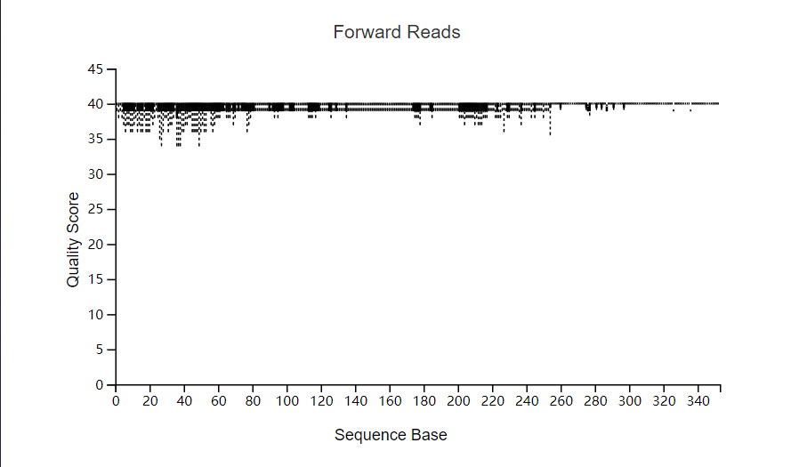

# 16s rDNA分析

参考教程[QIIME 2教程. 07Cell帕金森小鼠Parkinson‘s Mouse(2020.11，最佳实战)](https://metagenome.blog.csdn.net/article/details/76647849)

[qiime2 官方论坛](https://forum.qiime2.org/) 

从ena\ncbi上下载的序列，其格式为fastq，即带有质量信息的序列数据。数据已经去除引物和接头。

## 从ncbi和ebi下载数据.

参考[GMrepo2021 数据下载](https://shimo.im/docs/UR6aCGC4ZNUm2Tuj/read)


## 导入数据成为qiime2 对象

使用qiime2进行分析。第一步是写一个manifest文件，manifest文件包含样本id和数据绝对路径的信息。

[python script for make manifest](goodTHEyouth/microbiome_analysis/qiime2_analyse/create_manifest_pairend.py)


导入数据可视化, 看质量信息



## 去噪

根据质量信息，使用data2去噪，获得data2_stats.qza, 可视化的结果是data2_stats.qzv, 打开可视化结果,将其导出成为metadata, 供后面的步骤使用。


### table.qza（拓展内容）
QIIME 2 的产物 qza 后缀文件相当于一个压缩包，可以使用 “ unzip ”命令解压。
特征表文件 feature_table.qza 或 table.qza 文件解压后，在 data/ 目录下会获得一个后缀为.biom的文件，将其转换为 tsv 文件的命令是
```shell
biom convert -i feature-table-class.qza -o table.tsv --to-tsv 
```

## 过滤feature table
feature 是什么意思？

feature
